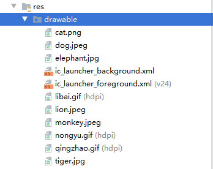
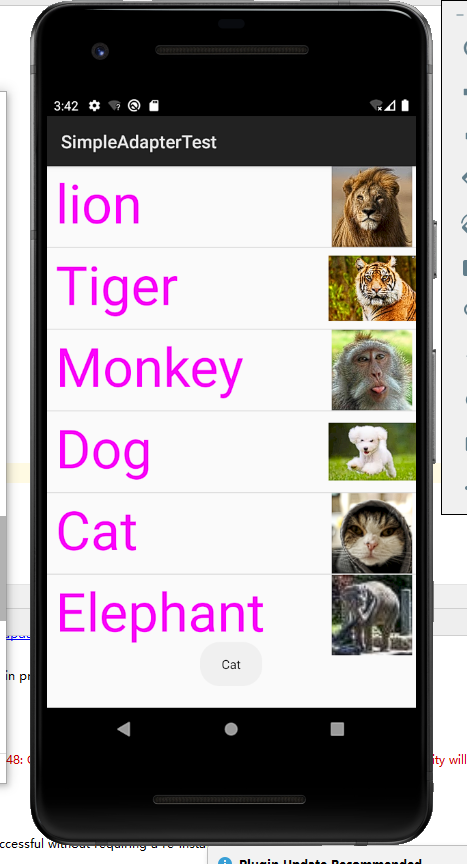
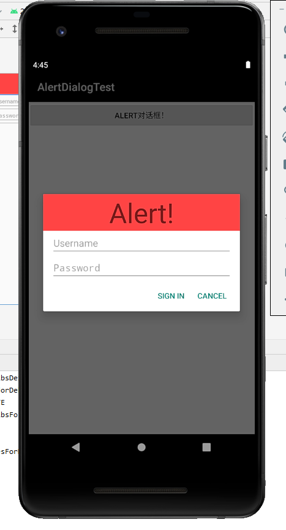
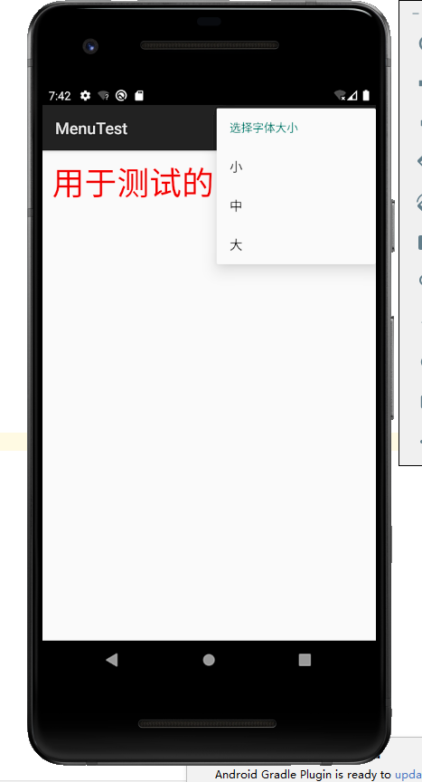
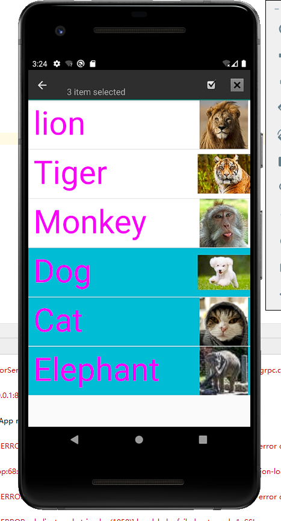

# Android UI组件

## Android ListView的用法

### 首先创建名字数组和图片数组

```java
private String[] names = new String[]{"lion", "Tiger", "Monkey", "Dog","Cat","Elephant"};
private int[] imageIds = new int[]{R.drawable.lion,
      R.drawable.tiger, R.drawable.monkey, R.drawable.dog,R.drawable.cat, R.drawable.elephant};
```

### 图片数组放在drawable下面



### 创建一个list集合，通过map键值对实现对应关系

```java
List<Map<String, Object>> listItems = new ArrayList<>();
for (int i = 0; i < names.length; i++)
{
   Map<String, Object> listItem = new HashMap<>();
   listItem.put("header", imageIds[i]);
   listItem.put("personName", names[i]);
   listItems.add(listItem);
}
```

### 定义一个SimpleAdapt，将list加入Adapt中

```java
SimpleAdapter simpleAdapter = new SimpleAdapter(this, listItems,
R.layout.simple_item, new String[]{"personName", "header"},
new int[]{R.id.name, R.id.header});
ListView list = findViewById(R.id.mylist);
```

### 设置一个按键监听器将toast响应加入

```java
	list.setOnItemClickListener((parent, view, position, id) -> {
		Log.i("-CRAZYIT-", names[position] + "被单击了");
		Toast toast = Toast.makeText(MainActivity.this,
				names[position], Toast.LENGTH_SHORT); // 设置该Toast提示信息的持续时间
		toast.show();
	});
```

### 最后效果图

```xml
<Button    android:layout_width="wrap_content"    android:layout_height="wrap_content"    android:layout_weight="1"    android:text="One,One"    android:textSize="15dp"    android:textAllCaps="false"/>
```

### 效果图如下




## 创建自定义布局的AlertDialog

### 调用AlertDialog.Builder方法设置两个按键并且显示

```java
		TableLayout loginForm = (TableLayout) getLayoutInflater().inflate(R.layout.login, null);
		new AlertDialog.Builder(this)
				// 设置对话框的图标
				.setIcon(R.drawable.tools)
				// 设置对话框显示的View对象
				.setView(loginForm)
				// 为对话框设置一个“确定”按钮
				.setPositiveButton("Cancel", (dialog, which) -> {
					// 此处可执行登录处理
				})
				// 为对话框设置一个“取消”按钮
				.setNegativeButton("Sign in", (dialog, which) -> {
					// 取消登录，不做任何事情
				})
				// 创建并显示对话框
				.create().show();
```

在布局中设置一个TextView和两个EditText，TextView设置背景颜色！

最后效果图如下



## 使用XML定义菜单

### 直接在MainActivity中定义菜单，用menu.addSubMenu/menu.add添加大选项！

再用fontMenu.add来添加小的选项

```java
SubMenu fontMenu = menu.addSubMenu("字体大小");
```

```java
menu.add(0, PLAIN_ITEM, 0, "普通菜单项");
```

```java
fontMenu.add(0, FONT_10, 0, "小");
```

最后通过onOptionsItemSelected(MenuItem mi)判断是哪种点击方式来反馈效果到文本上！



## 创建上下文操作模式(ActionMode)的上下文菜

### 在小实验1的基础上通过  

### **ListView.setItemChecked(int position,  boolean  value)**方法来选中被点击的Item，这时之前在list_item中设置的android:background="@drawable/list_selector"就开始生效了

### 然后判断选定状态即可!如果选定变为蓝色！



# 谢谢！