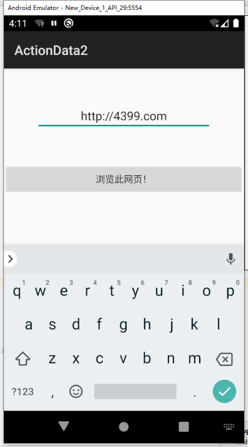

# 新建一个工程使用WebView来加载URL

通过EditText进行接收输入的网址 

```java
EditText editText1 =(EditText)findViewById(R.id.editText);
```

通过Button进行动作接收

```java
bn.setOnClickListener(view ->
```

最后调用隐式Intent进行网页跳转

```java
          Uri uri = Uri.parse(str1);
         Intent intent = new Intent(Intent.ACTION_VIEW, uri);
//       Bundle bundle = new Bundle();
//       bundle.putString("FIRST_APP_KEY", str1);
//       intent.putExtras(bundle);
         startActivity(intent);
```

输入网址！


跳转成功！


# 新建一个工程使用WebView来加载URL

最主要的是在Androidmanifest中intent-filter属性里加入以下几句代码使上个程序能够选择浏览器从而识别到我自制超级浏览器

```xml
			<intent-filter tools:ignore="AppLinkUrlError">
				<action android:name="android.intent.action.VIEW"/>
				<category android:name="android.intent.category.DEFAULT"/>
				<data android:scheme="http"/>
			</intent-filter>
```

在MainActivity中调用Webvie

```java
Bundle bundle = this.getIntent().getExtras();
String value = bundle.getString("FIRST_APP_KEY");
   webView.loadUrl(value);
webView.setWebViewClient(new WebViewClient() {
   @Override
   public boolean shouldOverrideUrlLoading(WebView view, String url) {
      // TODO Auto-generated method stub
      // webView加载web资源
      view.loadUrl(url);
      return false;
   }
});
```

运行后即可生成WuDiBrower


之后在运行上一题做的隐式调用软件！

输入最高档最好玩的网页4399.com



输完网址后弹出选择框！


点击使用方式后即可进入青春网站！


# 谢谢！