# 期中项目

## 项目结构

NoteEdite：笔记编辑类(Activity)

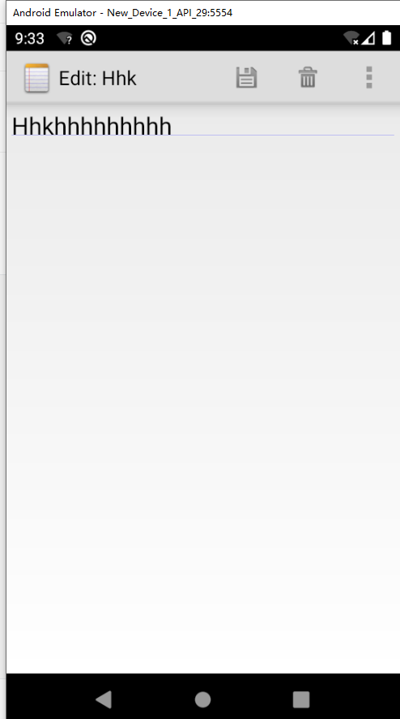


NotePad：协议类(定义数据库的常量以及字段)

NotePadProvider：进行数据库的具体操作

NoteList：笔记显示类(Activity)，创建显示笔记和监听以及标题的创建监听，您还别说，那可是这次的重头戏

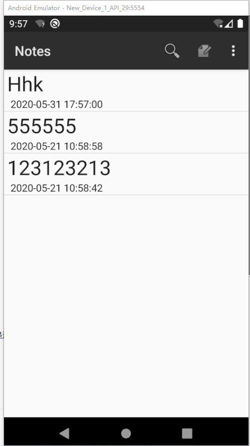

TitleEdit:笔记标题编辑类(Activity)，笔记标题的显示


#### 修改时间戳和添加搜索功能实际上都是在NoteList中显示，所以重点就在其中！**


## 笔记列表显示笔记条目的修改时间

### 布局文件layout

#### noteslist_item：

在线性布局下创建两个TextView用来显示笔记标题(text1)和时间戳(text2)！

```xml
<TextView
    android:id="@android:id/text1"
    android:layout_width="wrap_content"
    android:layout_height="wrap_content"
    android:textSize="30dp"
    android:gravity="left"
    android:paddingLeft="5dip"
    android:textAppearance="?android:attr/textAppearanceLarge" />

<TextView
    android:id="@android:id/text2"
    android:layout_width="match_parent"
    android:layout_height="match_parent"
    android:textAppearance="?android:attr/textAppearanceLarge"
    android:textSize="15dp"
    android:gravity="center_vertical"
    android:paddingLeft="10dip"
    android:singleLine="true"
    android:layout_weight="1"
    android:layout_margin="0dp"
    />
```

#### list_options_menu:

在原本menu框架下新建item→menu_search选项并且定义他的action：android.widget.SearchView具体UI如下

```xml
<item android:id="@+id/menu_search"
    android:orderInCategory="0"
    android:title="搜索菜单"
    android:icon="@android:drawable/ic_menu_search"
    android:showAsAction="always|collapseActionView"
    android:actionViewClass="android.widget.SearchView" />
```

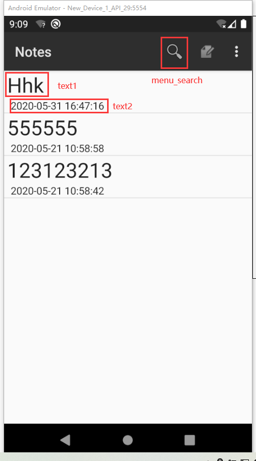


### 重头戏来了，现在轮到NoteList了

因为早在最开始运行时PROJECTION中并没有获取MODIFICATION_DATE修改时间，所以先要获取

```java
private static final String[] PROJECTION = new String[] {
        NotePad.Notes._ID, // 0
        NotePad.Notes.COLUMN_NAME_TITLE, // 1
        NotePad.Notes.COLUMN_NAME_MODIFICATION_DATE
};
```

在显示笔记列表的那部分中

dataColums新增一属性修改COLUMN_NAME_MODIFICATION_DATE获取数据！

viewID也新增text2来获得布局中的id！

```
String[] dataColumns = {NotePad.Notes.COLUMN_NAME_TITLE, NotePad.Notes.COLUMN_NAME_MODIFICATION_DATE} ;
int[] viewIDs = { android.R.id.text1 ,android.R.id.text2};
```

这里初始获得时间数据为毫秒格式，我们可以查看一下其中的数据！

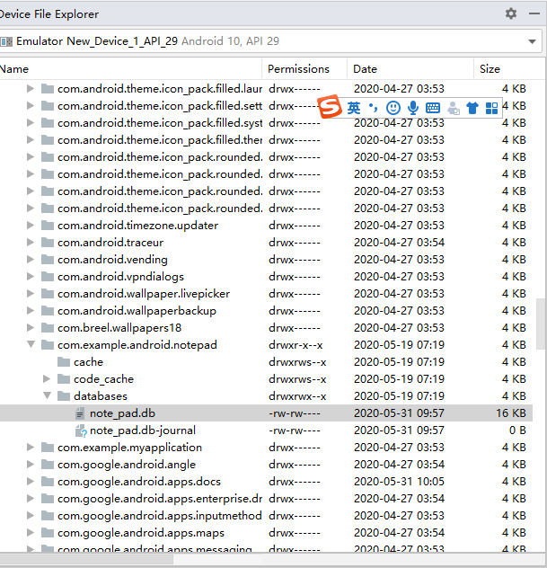


所以通过新增viewBinder更改时间戳格式并且修正时间，可以检查从数据库里的cursor获得相同id的时间戳，由于还有8小时时差，这里我先加了28800000毫秒然后再换算成时间格式！

```java
SimpleCursorAdapter.ViewBinder viewBinder=new SimpleCursorAdapter.ViewBinder() {
    @Override
    public boolean setViewValue(View view, Cursor cursor, int i)
    {
        if(cursor.getColumnIndex(NotePad.Notes.COLUMN_NAME_MODIFICATION_DATE)==i){

            TextView textView1=(TextView)view;
            SimpleDateFormat simpleDateFormat = new SimpleDateFormat("yyyy-MM-dd HH:mm:ss");
            Date date = new Date(cursor.getLong(i)+28800000);
            Log.d("WTF1", "onCreate1:"+date);
            String time=simpleDateFormat.format(date);
            Log.d("TIME", "onCreate1:"+time);
            textView1.setText(time);
            return true;
        }
        return false;
    }
};
adapter.setViewBinder(viewBinder);
```

### 功能1实现：

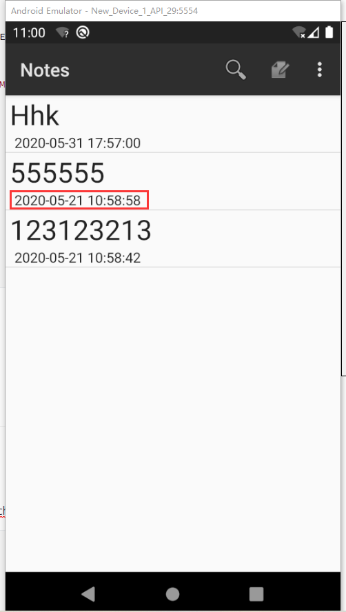

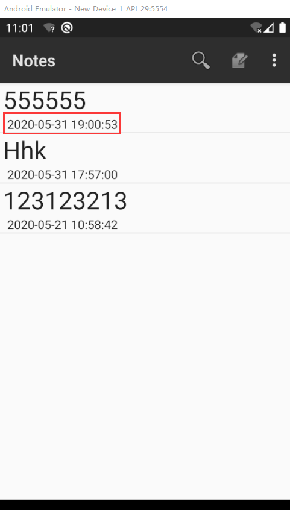


### 功能1完成！

## 笔记内容的搜索功能

### 布局文件layout

#### list_options_menu:

在原本menu框架下新建item→menu_search选项并且定义他的action：android.widget.SearchView

```xml
<item android:id="@+id/menu_search"
    android:orderInCategory="0"
    android:title="搜索菜单"
    android:icon="@android:drawable/ic_menu_search"
    android:showAsAction="always|collapseActionView"
    android:actionViewClass="android.widget.SearchView" />
```

即可增加一个menu选项

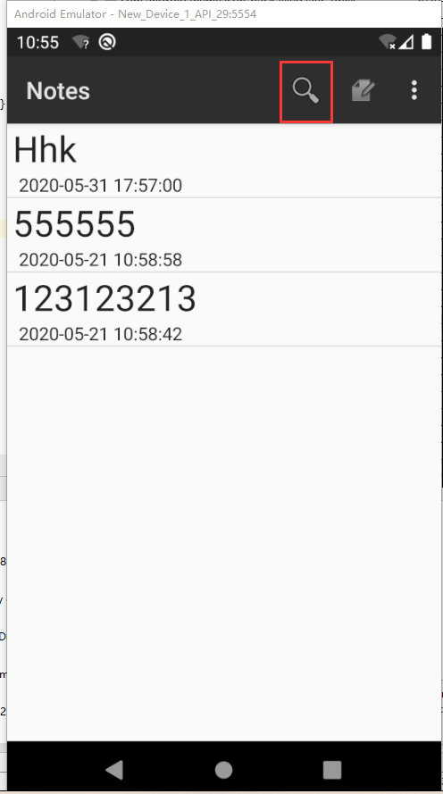

而搜索功能的关键就在于创建菜单onCreateOptionsMenu中的查询文字变化监听onQueryTextChange的重写！

当查询文字栏中发生变化时，都会进行查询，这时在cursor选项的selection中加入条件即可过滤出标题查询数据

```java
String selection=NotePad.Notes.COLUMN_NAME_TITLE+" GLOB '*"+newText+"*'";//query selection condition
Cursor cursor = managedQuery(
        getIntent().getData(),            // Use the default content URI for the provider.
        PROJECTION,                       // Return the note ID and title for each note.
        selection,                             // No where clause, return all records.
        null,                             // No where clause, therefore no where column values.
        NotePad.Notes.DEFAULT_SORT_ORDER  // Use the default sort order.
);
```

再调用SimpleCursorAdapter即可改变笔记列表的视图！

这里有一点需要判断查询文本是否为空，这样在返回时就可以回到所有笔记视图！

```java
if(!newText.equals("")){}
```

### 功能2演示：

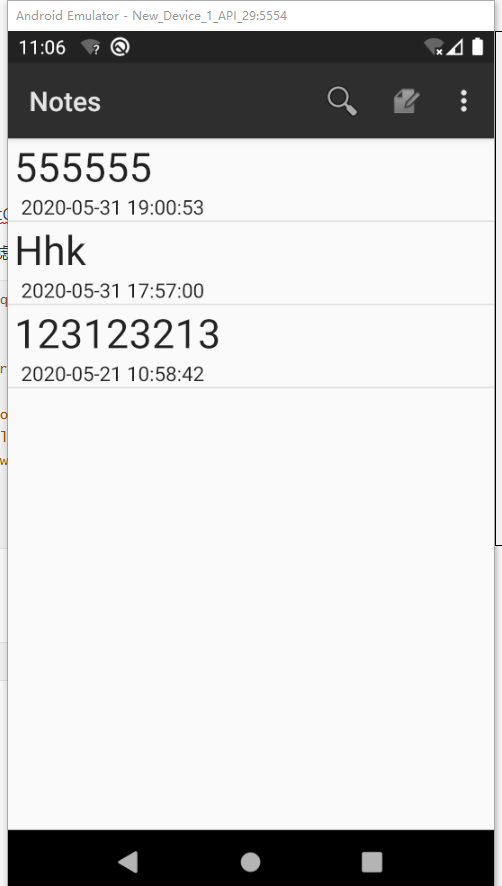

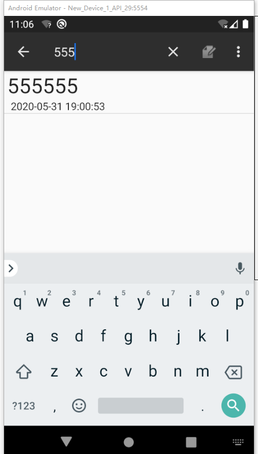

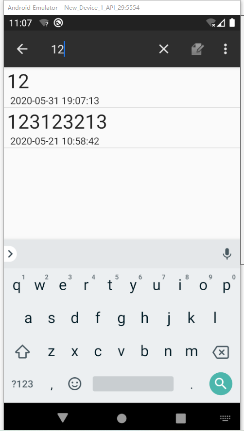

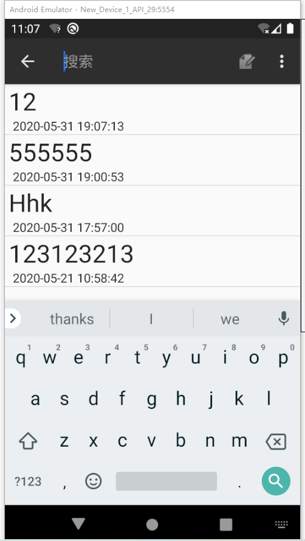


### 功能2完成！

# 谢谢！